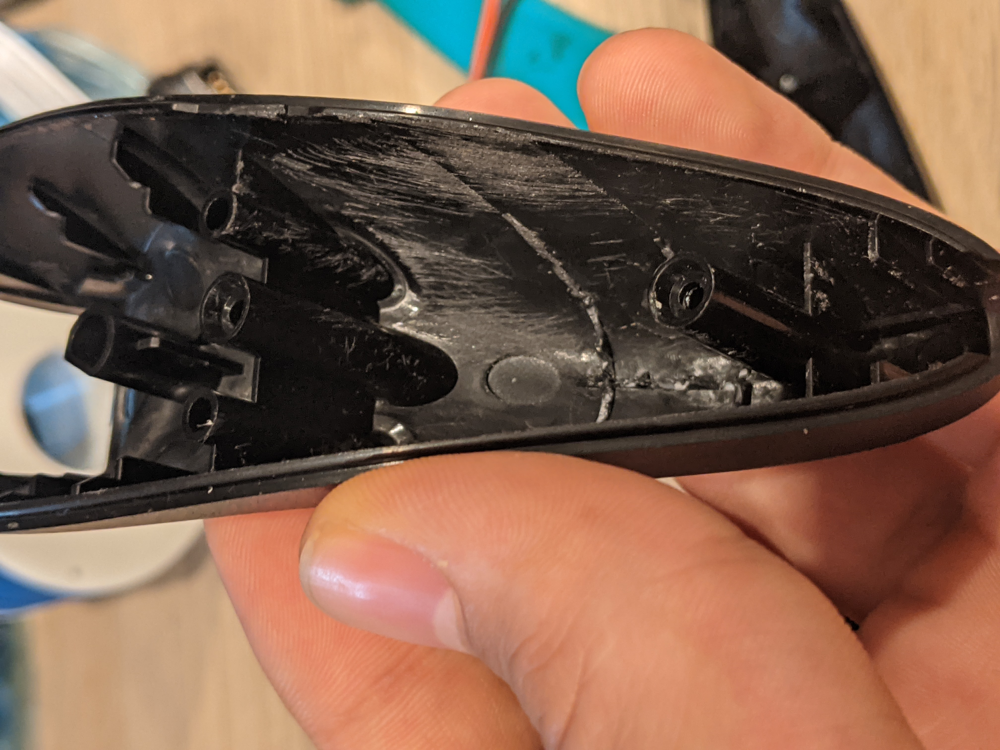

# onechuk
A modded-out Nintendo Wii Nunchuk controller with an ESP32 running machine learning (Tensorflow Lite for Microcontrollers) on joystick commands.

The one nunchuk that can do it all: onechuk.

## Main features
- Single RGB LED for readouts
- Multiple action mapping sets
  - Admin (Red): Restart, Enter deep sleep, Get BLE status, accelerometer/joystick debug
  - BLE HID (Green): Pause/Play, Prev/Next Track, Volume Up/Down, Start BLE pairable window
- Built-in LiPo w/ charging unit (charge via micro USB port)
- Automatically enters deep sleep if inactive for 60 seconds to conserve battery
- Wake up from deep sleep by tapping micro USB port


Deep sleep wakeup by tapping micro USB port

## Compiling
This project is built using [ESP-IDF](https://docs.espressif.com/projects/esp-idf/en/latest/esp32/get-started/). You can use the VSCode extension, Eclipse plugin or the typical CLI commands yourself:
```
idf.py build
idf.py -p <port> flash
```

## Overview

### Boot modes
Like a computer, onechuk has multiple boot modes. Also like a computer, you select the boot mode by holding down certain keys at startup.

### Device Mode (Tensorflow)
Device mode is the default boot mode. It allows the user to make joystick commands by holding down the "Z" button and drawing some shape with the joystick. Upon releasing the "Z" button, inference is performed on the drawn shape and if the probability is high enough, the action is executed. The current command can be ignored by pressing the "C" button mid-gesture.

There are multiple action mapping sets allowed, called "device profiles". A device profile is nothing more than a class with a series of logically linked callback functions. The action that gets performed depends on which device profile is active; a circle gesture on the BLE HID device profile will make it pairable, while a circle gesture on the admin profile will restart the ESP32. Same gesture, multiple possible actions.

You can cycle through device profiles by pressing the "C" button.


### Training Mode
Training mode sends raw joystick data over UART to a connected PC. You can boot into training mode by holding down the "C" button during startup. Once the LED flashes orange after the init sequence, training mode has been entered.

#### Collecting training data
Training data collection is made simple by running the `training/collect_training_data.py` script. Make joystick gestures as you normally would (hold down "Z" button and draw) and press "Enter" to delete the last sample. Data is automatically saved to the `training/data` directory when you exit the program. There are some pre-trained gestures:
- Circle
- Left flick
- Right flick
- Up flick
- Down flick
- Center click

I've found that ~200 samples/gesture is more than plenty. By default 25% of the collected data is reserved for validation. This can be modified with the `--pct_test_data` argument.


#### Training the model
The model is trained by running the `training/train_model.py` script. Three model files are written to the `training/output` directory:
- `gesture_model.tflite`: standard TFLite model
- `gesture_model_tflite.cc`: model as C array
- `gesture_model_tflite.h`: header for C array model

The latest model files are automatically copied from the `training/output` directory at compile time. Collect, train, compile, done. The model performs very well, often topping 99% for probability:


_**NOTE: The training script uses the xxd unix command to generate the C files and will fail using Windows' Command Prompt.**_ One solution is to use [WSL](https://docs.microsoft.com/en-us/windows/wsl/install-win10) as a shell and install xxd through `sudo apt install xxd`. 

## Construction
The physical construction process is briefly described here.

### Parts List
- [Nunchuk controller](https://www.amazon.com/Nintendo-Nunchuk-Controller-Black-Wii-U/dp/B0094X1ZXU/) (original Nintendo version)
- [TinyPICO Nano](https://www.tinypico.com/tinypico-nano) ESP32 development board
- [400mAh LiPo Battery](https://www.adafruit.com/product/3898) 
- [RGB LED](https://www.amazon.com/EDGELEC-Tri-Color-Multicolor-Diffused-Resistors/dp/B077XGF3YR/) (pack of 100)
- [Micro USB connector](https://www.adafruit.com/product/1829)
- ["Wire Wrap"](https://www.adafruit.com/product/1446)

### CAD
The micro USB port housing is a friction-fit 3D-printed piece. Use CA to glue the micro USB connector to the housing, then friction-fit the housing into the nunchuk. If CA gets on the front of the connector and prevents touches from registering, lightly scrape it off with an exacto knife.

CAD files can be found in the `CAD` folder.


### Original vs. knockoff nunchuks
Initially I planned on using a cheap nunchuk clone instead of one sold by Nintendo, given their outrageous prices. It became clear that the analog joystick quality on the cheap knockoff was so poor that data couldn't be shared between a knockoff and an original nunchuk, at which point I broke down and got an original. All data collected using an original, Nintendo, "real" nunchuk is prefixed with an "r", in case I decide to go back and collect gesture data using a "fake" nunchuk at some point.


The circle gesture on knockoff (left) vs. original (right) nunchuks

### Fitting everything in
Nunchuks can have a decent amount of interior space if you clear out the excess support material. This can be done with a pair of flush cutters and some high-grit sandpaper:



Then it's just a matter of soldering and assembly:


## Acknowledgements
Inspired by https://github.com/jakkra/Gesture-Detecting-Macro-Keyboard. Some code (especially for training) is modified and reused.
